# RaspberryPi-GPIO-Displays

**Update 11 Aug 2020:** `There are new device tree FBCP driver files for the both the Waveshare Type C (125MHz SPI) LCD, and the Waveshare Type B revision 2 LCD`. For the first go to [**swkim01 github page**](https://github.com/swkim01/waveshare-dtoverlays), and both new source (dts) and compiled (dtb) drivers are her in the waveshare35bv2 folder. Both LCD displays `function well with the new kernel 5.4 - but only tested here for the RaspberryPi 3B+`. *Compilation details using the latest version of dtc, to build new working drivers for kernel 5.4, are given further down this page.*


### Kernel 4.19
Two Waveshare 3.5" 480x320 ILI9486 type B rev2 and type C displays, were tested with the [**Waveshare LCD-show**](https://github.com/waveshare/LCD-show) drivers, and also with three other driversets: [**GoodTFFT**](https://github.com/goodtft/LCD-show) - use the MHS35-show for Waveshare (C) LCD, and [**swkim01**](https://github.com/swkim01/waveshare-dtoverlays) and [**JBTEK**](https://github.com/acidjazz/jbtekoverlay). All four driversets functioned adequately when using the previous (May 2020) Raspberry Pi Linux 4.19 kernel. None of the four driversets worked at all, with the current (July 2020) Raspberry Pi Linux kernel 5.4.

The two LCD displays used for the tests are the [**Waveshare display B v2 IPS 12 MHz SPI**](https://www.waveshare.com/3.5inch-rpi-lcd-b.htm), which is on the left below, and the [**Waveshare display C 125MHz SPI**](https://www.waveshare.com/3.5inch-rpi-lcd-c.htm) on the right.
<p align="left">
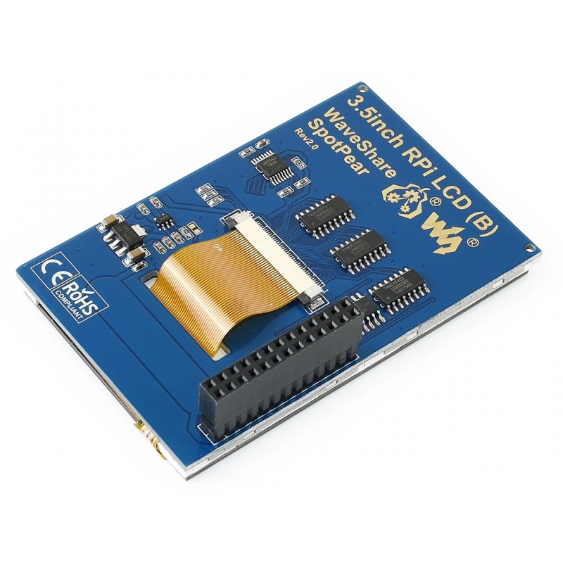  
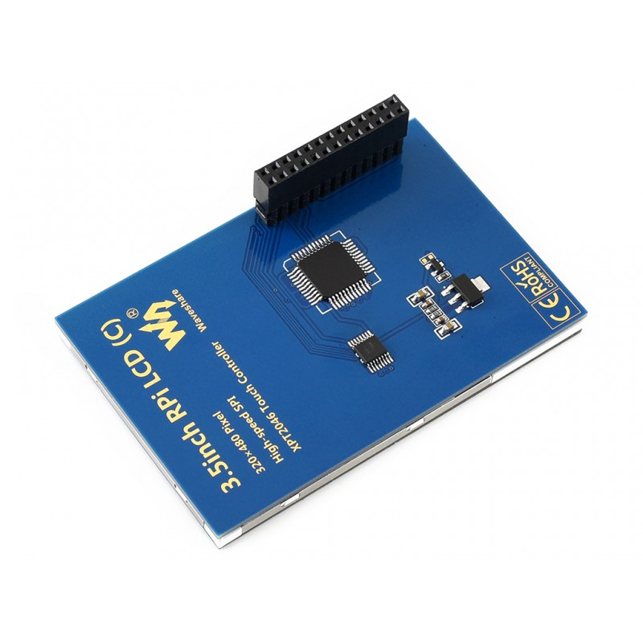  
<br>
    
The set of eight photos below, show the results of using the Waveshare drivers with the (May 2020) 4.19 kernel. This can be compared to the results when using the SPI DMA accelerated driver with the new (July 2020) kernel 5.4, as detailed in the next section.

In order to obtain dual HDMI LCD displays add the following lines in /boot/config.txt:
```
hdmi_group=2
hdmi_mode=87
hdmi_cvt=480 320 60 1 0 0 0
hdmi_force_hotplug=1
```

**Raspberry Pi 3B+ and Waveshare 3.5" LCD IPS (B) 15 MHz SPI:**
<p align="left">
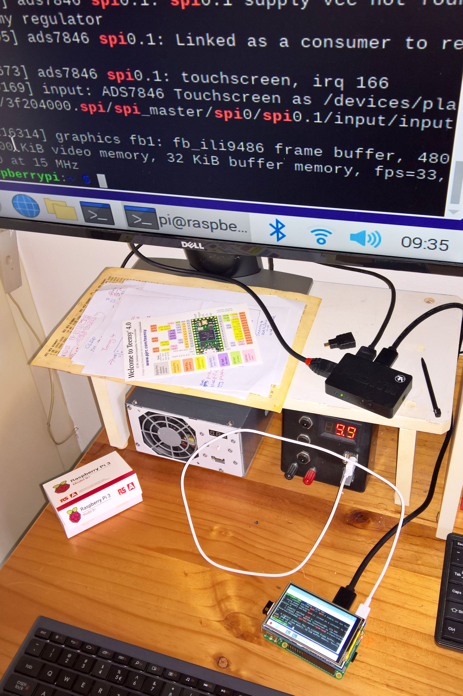  
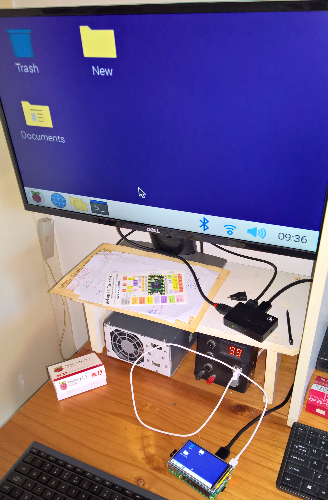 
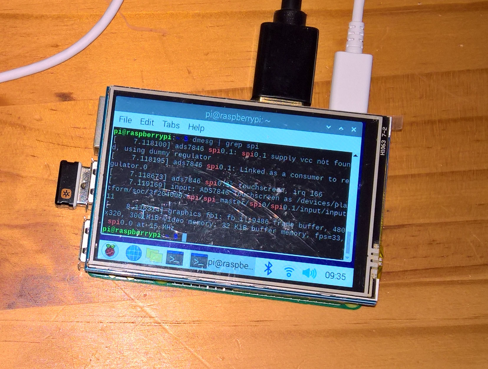  
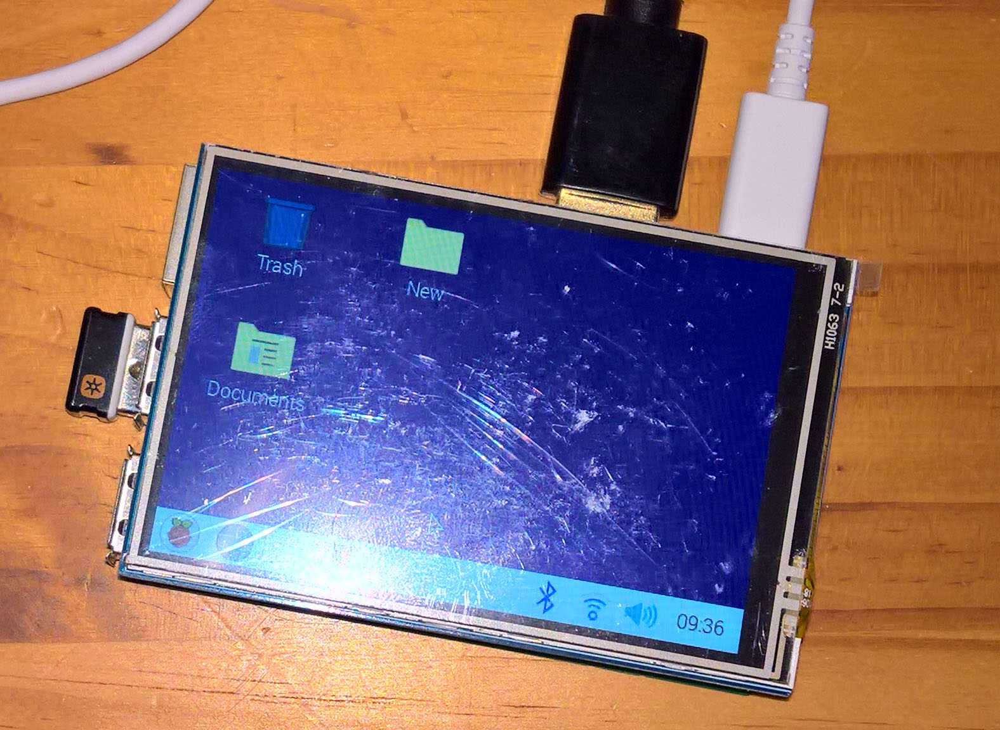    
<br>

**Raspberry Pi 3B+ and Waveshare 3.5" LCD (C) 125 MHz SPI:**    
<p align="left">
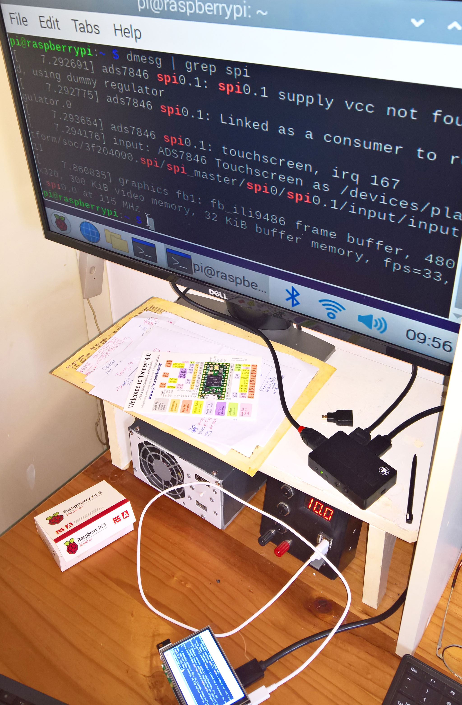  
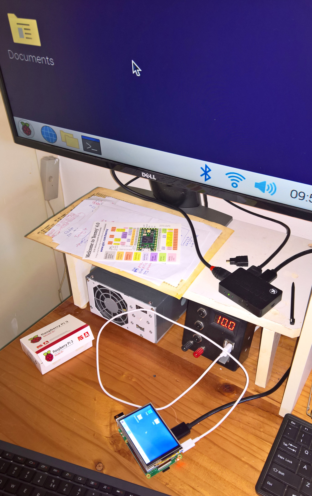 
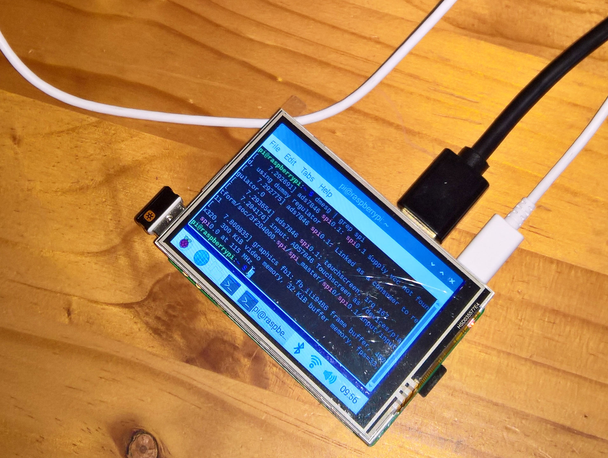  
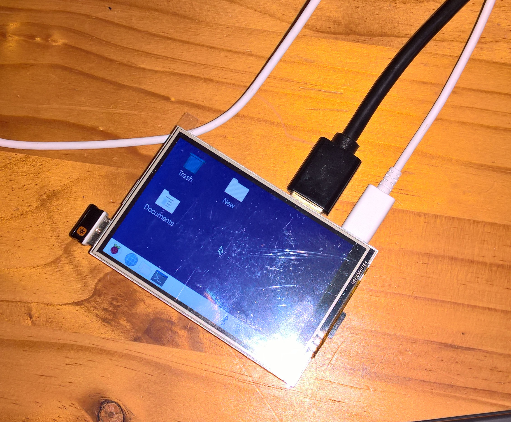     
<br>

The more robust Raspberry Pi 3B+ was used instead of the Raspberry Pi 4B, because of the latter's fiddly (*adjective: complicated or detailed and awkward to do or use*), micro-hdmi connector - I did not want to break it with frequent change-overs. The Raspberry Pi 4B does work with both displays using kernel 4.19.
    
### Kernel 5.4  

**Update 11 Aug 2020:** There are new driver files for both the Waveshare Type C (Fast SPI) and type B LCD displays. For the first it is on the [**swkim01 github page**](https://github.com/swkim01/waveshare-dtoverlays), and the type B version 2 display is here in the folder waveshare35bv2. Both these displays function well with kernel 5.4 (using a Raspberry Pi 3B+). 

As an alternative use one of the following two methods for working kernel 5.4 and Raspberry Pi3B+ dtoverlay drivers:

(1) Follow the Waveshare Wiki instructions to install the Waveshare type C or B rev 2 LCD, then reboot and replace the waveshare35c.dtbo or waveshare35b-v2.dtbo in /boot/overlays/ with the one from swkim01 in github, or for the Type B revision 2 LCD, from here in the folder waveshare35bv2 . 

(2) Follow the instructions here in the goodTFT folder to install the Waveshare type C or B rev 2 LCD, and then reboot.

**Compiling new SPI LCD drivers for kernel 5.4:** 
* Edit the dts files for the type C and B revision 2 LCD displays from the swkim01 Github page, and substitute 1 for 0 for both the reset and pendown GPIO's (reset-gpios = <&gpio 25 1>;  pendown-gpio = <&gpio 17 1>;). 
* Then get a newer version of dtc:  git clone git://git.kernel.org/pub/scm/utils/dtc/dtc.git, and then do make.
* Copy the new dts files into the dtc folder as well as the dtc.sh script from swkim01. 
* Then do: sudo dtc -@ -I dts -O dtb -o waveshare35c.dtbo waveshare35c.dts. Ignore the spidev warning. 
* The dtbo files can now be copied to the /boot/overlays/ folder.

Add the following lines in /boot/config.txt if they are not already there (change the waveshare35c to waveshare35b-v2 if required):
```
dtoverlay=waveshare35c:rotate=90
hdmi_force_hotplug=1
hdmi_group=2
hdmi_mode=1
hdmi_mode=87
hdmi_cvt=480 320 60 6 0 0 0
hdmi_drive=2
display_rotate=0
```
Make sure the line hdmi_cvt=480 320 60 6 0 0 0 has the equal sign, because the waveshare script is incorrect.

The folders swkim01 and waveshare35bv2, contain working config.txt and the dtbo files (as well as the dts source files).

For more information about this kernel 5.4 fix, see the following links:
* [**Waveshare 2.8" lcd and latest Pi OS**](https://www.raspberrypi.org/forums/viewtopic.php?f=38&t=281023)
* [**Zaryob: I just changed values of reset-gpios and pendown-gpio from 0x00 to 0x01**](https://github.com/waveshare/LCD-show/pull/30)
* [**Display remains white after kernel update**](https://github.com/goodtft/LCD-show/issues/223)
* [**White Screen after every Boot, maybe because of newest Kernel?**](https://github.com/rootzoll/raspiblitz/issues/1436)

**Kernel 5.4 + new dtoverlay fbcp drivers (Raspberry Pi 3B+ and Waveshare 3.5" LCD type (C) and type (B) revision 2):**      
<p align="left">
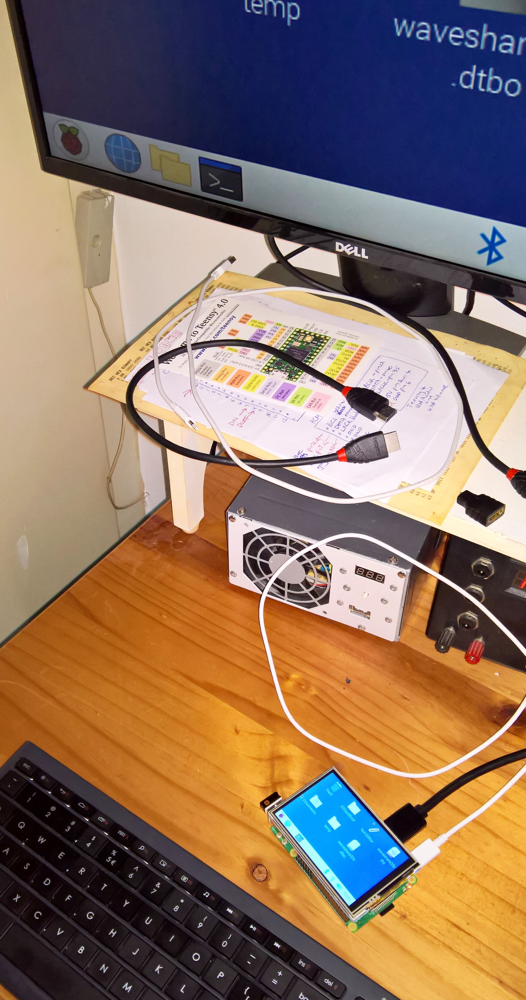  
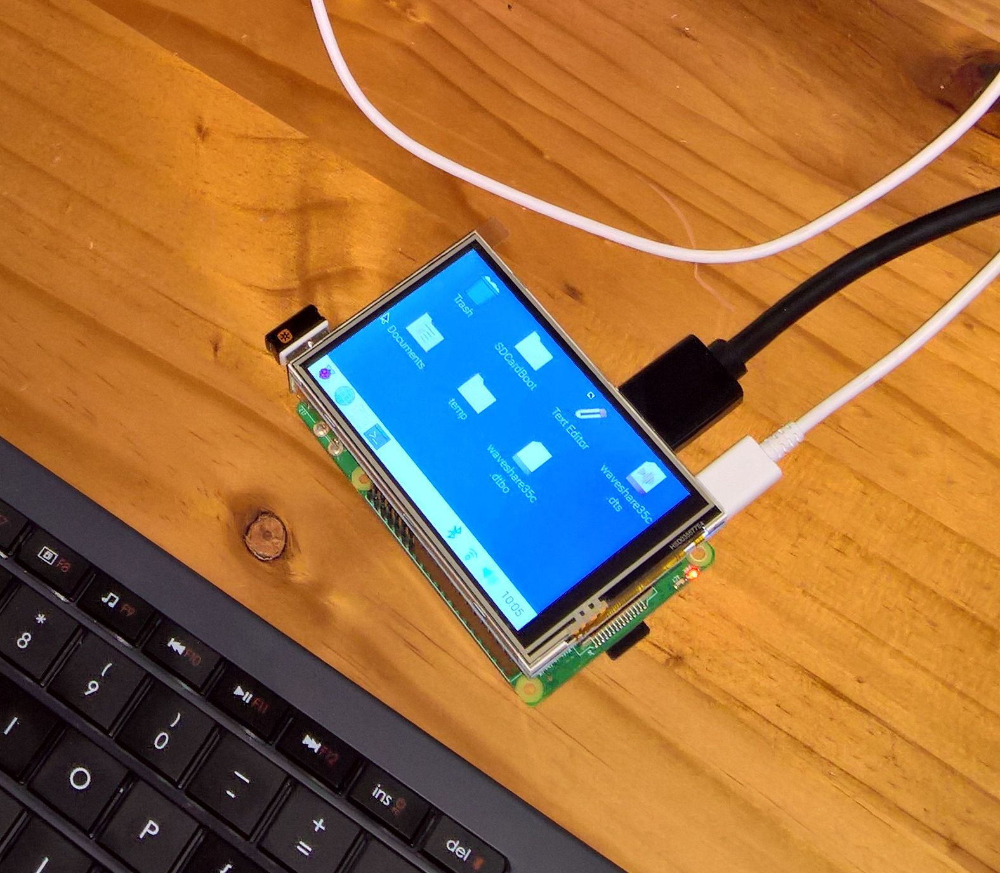     
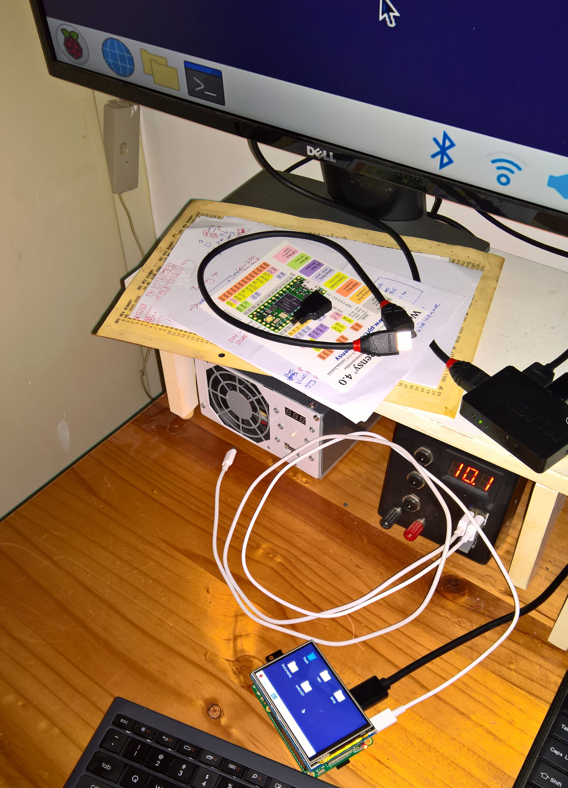  
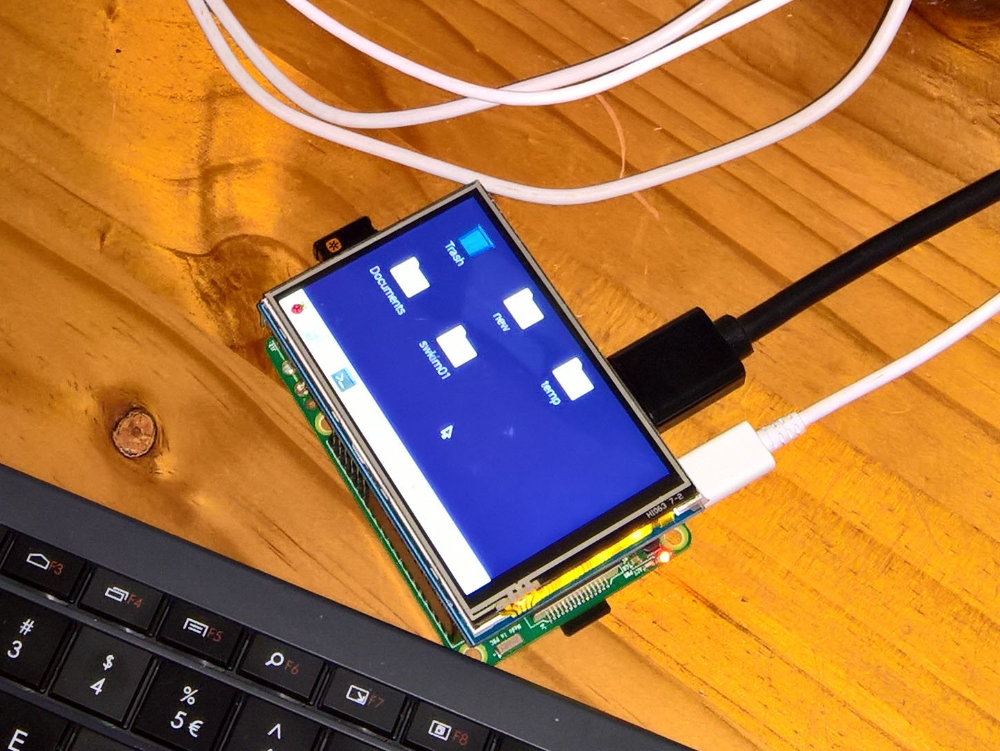  
<br>

**Previously:** A recent kernel update to version 5.4, changed the GPIO configuration for a number of small directly connected SPI LCD displays for the Raspberry Pi. Refer to this [**list of Raspberry Pi discussion Forum topics**](Discussion-RaspberryPiForum-LCDKernel54.txt). The reason seems to be that GPIO descriptors have been changed from pin numbers to labels. In [**Linux Staging fbtft Switch to the gpio descriptor interface**](https://github.com/torvalds/linux/commit/c440eee1a7a1d0f2d5fc2ee6049e4a05da540f01): *"This switches the fbtft driver to use GPIO descriptors rather than numerical gpios."* 

I used a nightly kernel `2020-08-06-raspios-buster-nightly-armhf` with a `Raspberry Pi 3B+ with a Waveshare type (B) rev2 3.5" LCD`, and a `Raspberry Pi 4 (4GB) with a Waveshare type (C) fast SPI 3.5" LCD`, for the description as outlined, below.

A new approach is to use the [**Custom SPI LCD driver**](/fbcp) at [**juj**](https://github.com/juj/fbcp-ili9341). This driver does not use the [**notro/fbtft**](https://github.com/notro/fbtft) framebuffer copy (FBCP) driver, i.e. lines such as dtoverlay=waveshare35xx should be removed from /boot/config.txt. This program also does not use the default SPI driver, so a line such as dtparam=spi=on in /boot/config.txt should also be removed. Similarly, if there are touch controller related dtoverlays active, such as dtoverlay=ads7846 those should be removed. There is not provision for a touch interface with this driver.

**I used the following to make the driver:**

    $ sudo apt-get install cmake
    $ git clone https://github.com/juj/fbcp-ili9341.git
    $ cd fbcp-ili9341
    $ mkdir build
    $ cmake -DSPI_BUS_CLOCK_DIVISOR=30 -DWAVESHARE35B_ILI9486=ON -DBACKLIGHT_CONTROL=ON -DDISPLAY_INVERT_COLORS=ON -DSTATISTICS=0 ..
    $ make -j
    $ cd fbcp-ili9341
    $ sudo ./fbcp-ili9341
    
Also add the following lines in /boot/config.txt:
```
hdmi_group=2
hdmi_mode=87
hdmi_cvt=480 320 60 1 0 0 0
hdmi_force_hotplug=1
```
To start at boot (this is different from the the previously discussed drivers which add the line fbcp &), edit the /etc/rc.local in sudo mode, and add the line:
```
sudo /home/pi/fbcp-ili9341/build/fbcp-ili9341 &
```
  
[**sudo-fbcp-ili9341-result.txt**](sudo-fbcp-ili9341-result.txt) shows the result of running the driver.

The result surprised me in the responsiveness of the LCD obtained - *subjectively measured using the user experience when moving the cursor around* - see [**VladStudio The Two and the Mouse**](https://vlad.studio/wallpaper/thetwoandthemouse) - when compared to using the same display with the Waveshare driver on kernel 4.19. For the type C display from Waveshare with a Raspberry Pi 4, the colours are inverted, and only the LCD has a display.

[**VladStudio The Two and the Mouse:**](https://vlad.studio/wallpaper/thetwoandthemouse)
The widely used user-experience **CUE factor** i.e. the cursor usability effort = drag coefficient of moving the mouse cursor to a specified point in order to complete a user task. (*In fluid dynamics, the drag coefficient is a dimensionless quantity that is used to quantify the drag or resistance of an object in a fluid environment.)*
<br>
<p align="left">
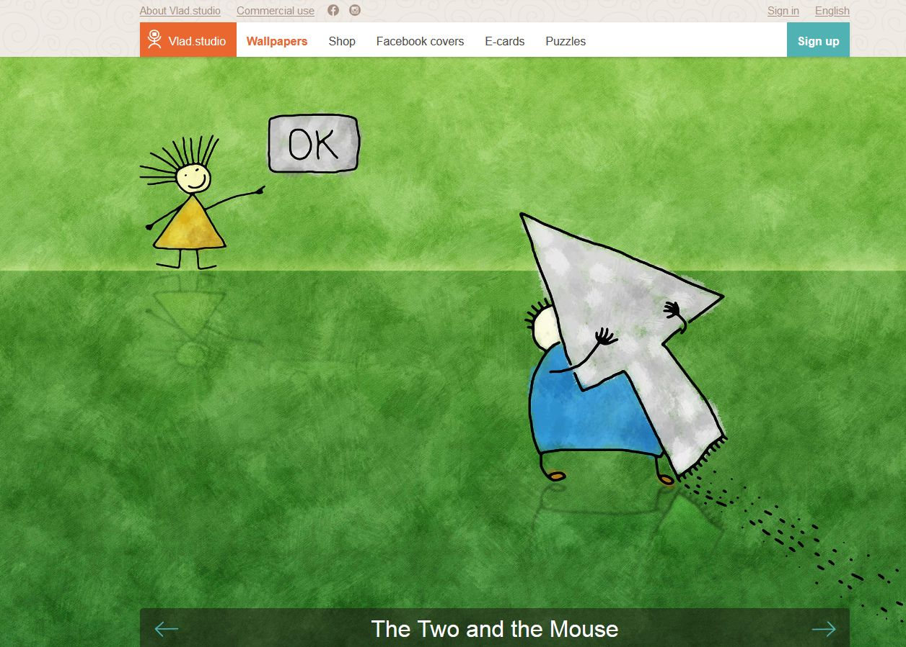  
<br>

### Raspberry Pi 3B+ and the Waveshare 3.5" (B) revision 2 LCD:
The first image is the result of the first run of the driver, and tries to run the LCD display at 1920x1080 pixels. The second, and fourth picture, is after the cmake line: `$ cmake -DSPI_BUS_CLOCK_DIVISOR=30 -DWAVESHARE35B_ILI9486=ON ..` was used to build the driver, and shows inverted colours. The third and the fifth picture is with the corrected colour driver.
<p align="left">
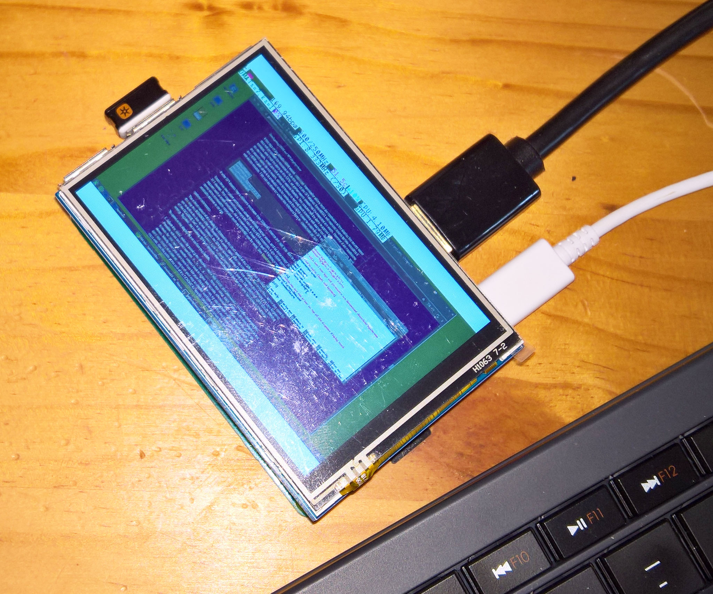  
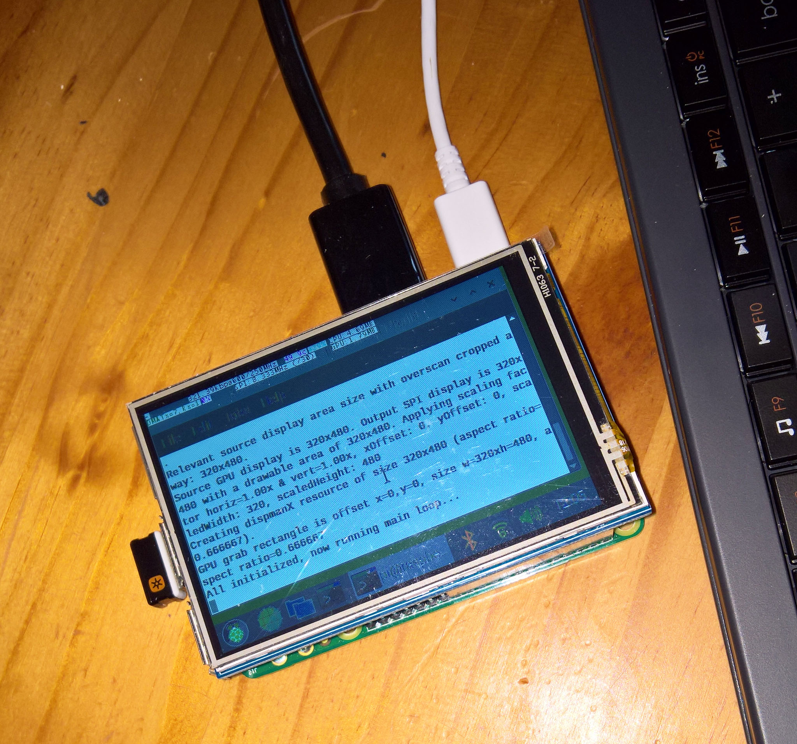  
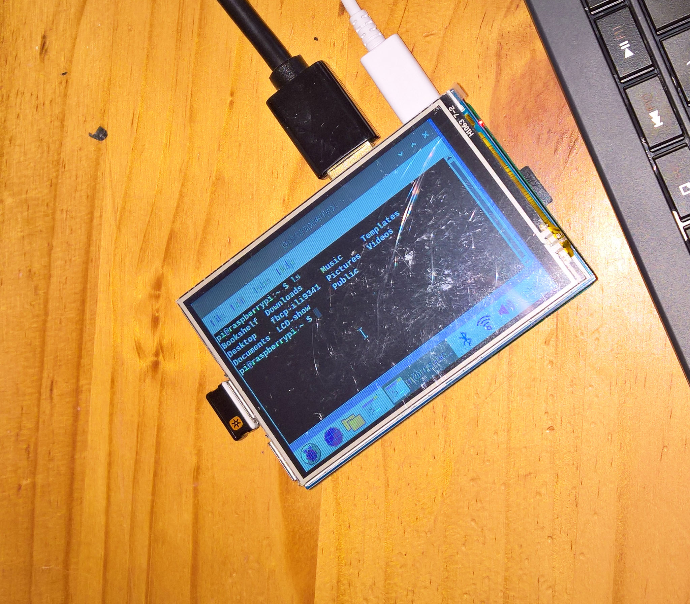  
<br>
   
<br>
<p align="left">
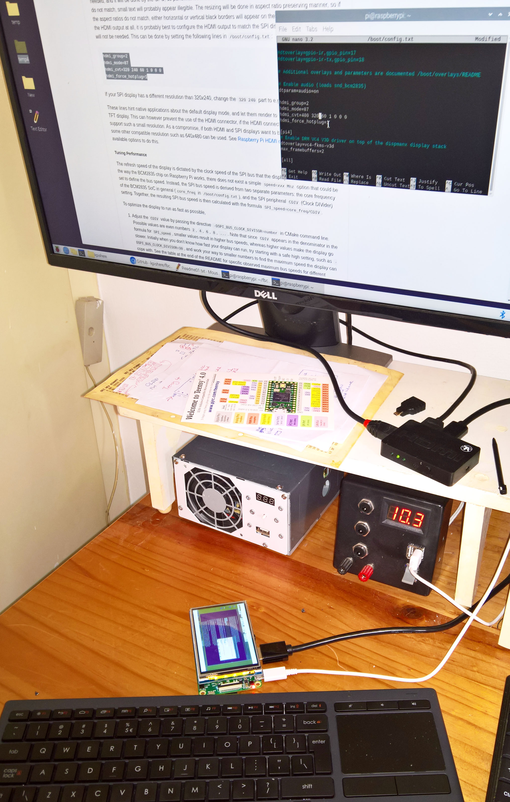  
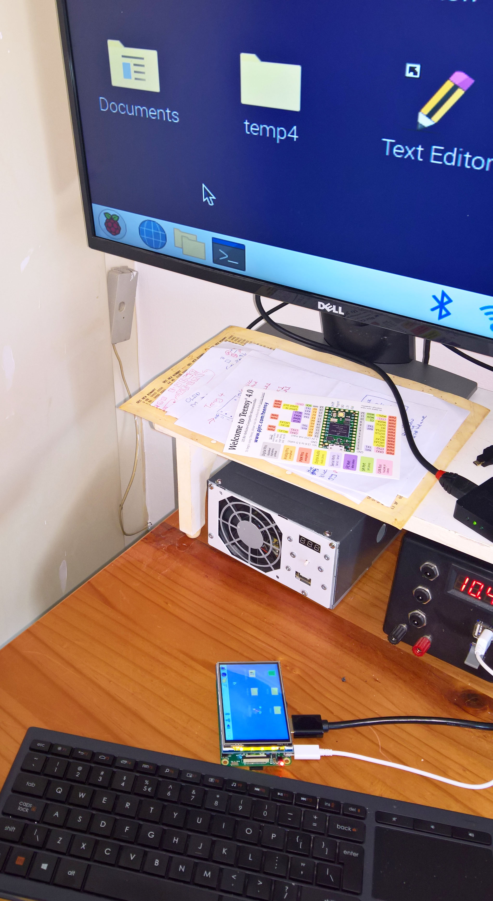  
<br>
    
### Raspberry Pi 4B (4GB) and the Waveshare 3.5" (C) fast SPI LCD:
The first image is the result of the first run of the driver (1920x1080 resolution), and the second after a reboot. The colours are inverted, and the cmake option -DDISPLAY_INVERT_COLORS=ON will be removed.

<p align="left">
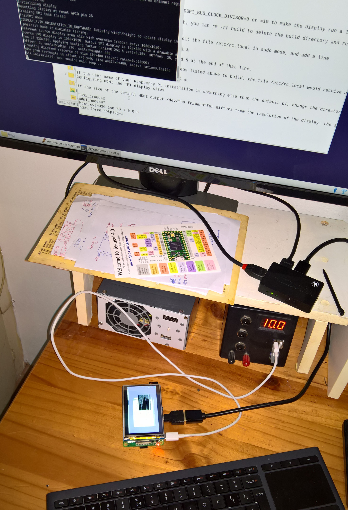  
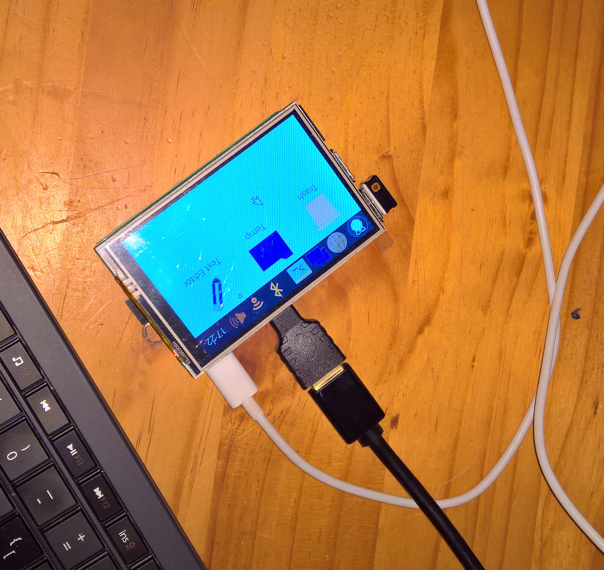  
<br>
    
Problems with these SPI LCD displays have been mentioned on the main [**Raspberry Pi kernel 5.4 update forum**](https://www.raspberrypi.org/forums/viewtopic.php?f=29&t=269769), but the solution presented there is only suitable for the older 3.2" type B and 3.5" type A Waveshare LCD's, which are no longer in production. *There are indications that the framebuffer driver problem may be as simple as changing the polarity of the gpio reset pin from 0 to 1.*

No - changing tft35a@0:reset-gpios:0 to tft35a@0:reset-gpios:1 with a hex editor in the dtb driver had no effect.

`Yes - a recent change (see swkim01 in github) has changed reset-gpios = <&gpio 25 1>; and the driver now functions with kernel 5.4`
[**Zaryob: I just changed values of reset-gpios and pendown-gpio from 0x00 to 0x01**](https://github.com/waveshare/LCD-show/pull/30)

<br>
<p align="left">
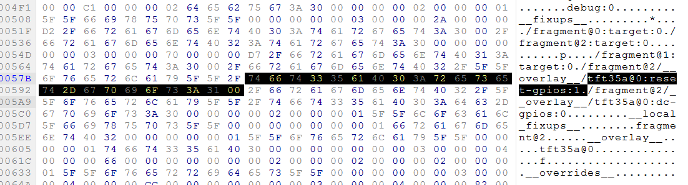  
<br
    
