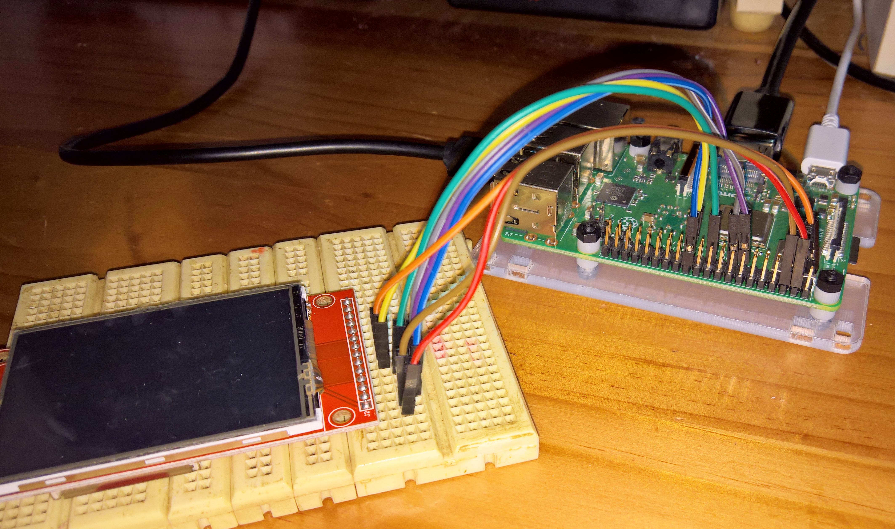
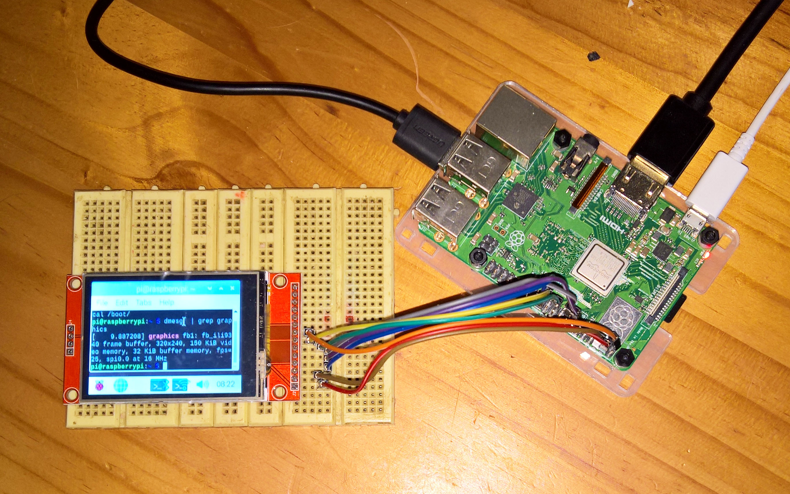
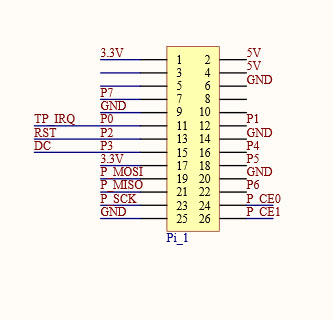
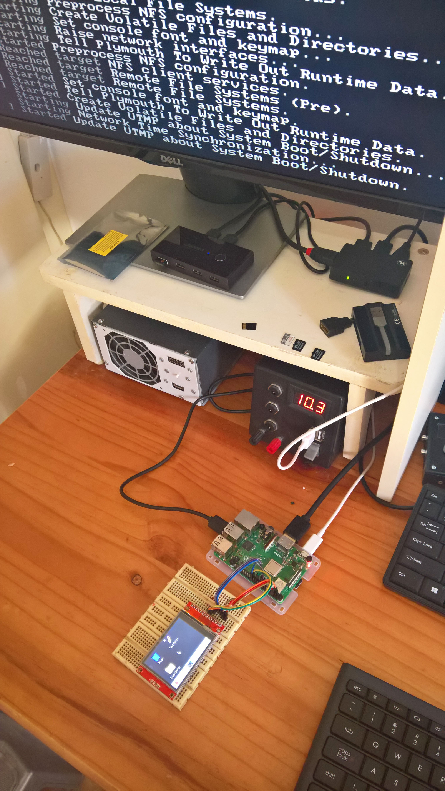

# ILI9341 Displays

[**ElectroDragon (EDS) LCD Displays SPI SD-Card Touch Size 1.8 to 4.0 inches**](https://www.electrodragon.com/product/eds-tft-lcd-lcm-spi-interface-variable1-82-2/)

The EDS 2.2" and 2.4" and 2.8" and 3.2" inch displays are ILI9341 at 320x240. Only the 2.2" has no resistive touch overlay.

**2.4 inch Model 320x240:** 
Top and bottom and schematic:
<p align="left">
  
 
  
<br>
The SDCard as configured on this model will not function when interfaced with a 3v3 MCU. To correct it, replace the 3 x 1k series resistors R1, R2, R3 with 0 ohm resistors or a solder bridge. Also connect SD-CS to a 10k resistor pullup to 3v3.

The display as supplied is also not in a Raspberry Pi GPIO compatible pin format. Details are given below in Table 1 for connecting to a Raspberry Pi standard 40 pin GPIO connector.

Table 1. Connect the display to Raspberry Pi (3B+ used):

|     LCD     | Pin  | RaspPi |  
|-------------|------|--------| 
|1 Vcc +5v    |	2 	  |  +5v   |  
|2 Gnd 	      |	6    |  Gnd   |  
|3 LCD-CS     | 24	  | GPIO 8 | 
|4 RST Reset  |	13 	 | GPIO 27| 
|5 DC         | 15 	 | GPIO 22|  
|6 MOSI       |	19 	 | GPIO 10|  
|7 SCLK       | 23	  | GPIO 11| 
|8 LED +3v    | 1	   | +3v3   |  
|9 MISO       |  	   |   NC   | 

*Note: Sometimes other Raspberry Pi pins are used for Reset and Data/Command such as pin 22 (gpio 25) for reset and pin 18 (gpio 24) for dc. The pin numbers in the table above are those used by the [**goodtft LCD24-show driver**](https://github.com/goodtft/LCD-show/blob/master/LCD24-show), [**LCD Wiki LCD24-show**](http://www.lcdwiki.com/2.4inch_RPi_Display), and [**swkim01 waveshare32b driver**](https://github.com/swkim01/waveshare-dtoverlays/blob/master/waveshare32b.dts).* 

*[**Notro**](https://github.com/notro/fbtft/blob/master/dts/overlays/rpi/rpi-display-overlay.dts) has a dts driver for the ili9341 but that uses different dc and reset pins (dc-gpios = <&gpio 24 0>; reset-gpios = <&gpio 23 0>;) and has not been tested (i.e. compiled to a dtbo driver after changing it to reset-gpios = <&gpio 23 1>; for kernel 5.45). Similarly some of the [**other LCD wiki drivers**](http://www.lcdwiki.com/3.5inch_RPi_Display) use pin 22 for reset and pin 18 for dc.*

Here are two high resolution photos that show the connection between the EDS ili9341 LCD and a Raspberry Pi3B+. LCD-CS is blue, LCD-Reset is purple, DC is gray, MOSI is green, SCLK is yellow, LED+3v3 is orange, Vcc+5v is red, and GND is brown
<p align="left">
  
  
<br>

### Kernel 5.4.58
I used a nightly kernel 2020-08-12-raspios-buster-nightly-armhf.img, and the dts driver from [**swkim01**](https://github.com/swkim01/waveshare-dtoverlays), who has compiled a waveshare ILI9340 driver for kernel 5.4 that can also be used for this type of ILI9341 LCD display:
```
git clone https://github.com/swkim01/waveshare-dtoverlays.git
sudo cp waveshare-dtoverlays/waveshare32b.dtb /boot/overlays/waveshare32b-overlay.dtb
sudo cp waveshare-dtoverlays/waveshare32b.dtb /boot/overlays/waveshare32b.dtbo
```

After this clone the Zaryob github [**Zaryob LCD-show**](https://github.com/Zaryob/LCD-show):
* Then edit his local copy of LCD35C-show and comment out the sudo reboot at the end. 
* Then proceed as shown below, but before doing a manual sudo reboot edit /boot/config.txt:
* Replace the line dtoverlay=waveshare35c:rotate=90 with the line dtoverlay=waveshare32b:rotate=270 (i.e add the driver overlay for ili9341 from swkim01). 
* Also change hdmi_cvt=480 320 60 6 0 0 0 to hdmi_cvt=320 240 60 6 0 0 0. If the first is left in place (correct it by adding the msiing =), then after reboot the LCD should attempt to display a 480x320 and the hdmi monitor should also display the same image. If the 320x240 setting is used only the LCD will show an image after reboot.
```
git clone https://github.com/Zaryob/LCD-show.git
cd LCD-show/
chmod +x LCD35C-show
sudo ./LCD35C-show
sudo reboot
```
Some of the configuration files and the driver files are in the folder kernel545. Although config.txt has lines (hdmi_cvt=320 240 60 6 0 0 0), that should output to the main hdmi monitor, the resolution at 320x240 is too low for the large screen. There is also a video ili9341kernel545.mp4 of the boot process with kernel 5.45 [**Video2**](https://github.com/TobiasVanDyk/RaspberryPi-GPIO-Displays/blob/master/ili9341kernel545.mp4)

The result is shown below:
<p align="left">
  
<br>
 
<p align="left">
  
  
<br>
 
 
[**Waveshare 3.2" type B Raspberry Pi SPI display**](https://www.waveshare.com/product/displays/lcd-oled/lcd-oled-2/3.2inch-rpi-lcd-b.htm)

Note that this means the [**Waveshare 3.2" B display**](https://www.waveshare.com/wiki/3.2inch_RPi_LCD_(B)), will also work with the exact same procedure as outlined for the Electrodragon ILI9341 display above, and using kernel 5.45. The Waveshare display has a direct [**Raspberry Pi GPIO interface**](https://www.waveshare.com/wiki/File:3.2inch-RPi-LCD-B-Schematic.pdf), and do not need individual connections, as in Table 1. It connects to the Raspberry pi as below:
<p align="left">
  
<br>


### Kernel 4.19
I used the 2020-05-27-raspios-buster-full-armhf.img without any updates, and the [**GoodTFT**](https://github.com/goodtft/LCD-show) LCD24-show driver. 
```
git clone https://github.com/goodtft/LCD-show.git
chmod -R 755 LCD-show
cd LCD-show/
sudo ./LCD24-show
```

The result is as shown below:
<p align="left">
  
<br>

 


