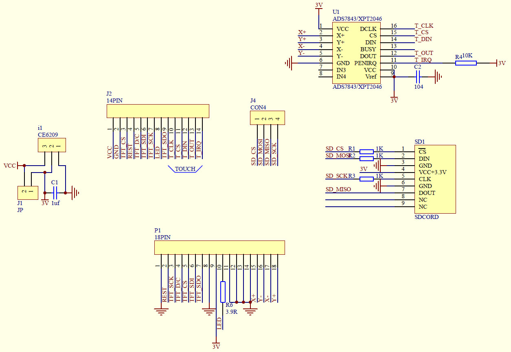

# ILI9341 Displays

[**ElectroDragon (EDS) LCD Displays SPI SD-Card Touch Size 1.8 to 4.0 inches**](https://www.electrodragon.com/product/eds-tft-lcd-lcm-spi-interface-variable1-82-2/)

**2.4 inch Model 320x240:** 
Top and bottom and schematic:

  
 
  
 
The SDCard as configured on this model will not function when interfaced with a 3v3 MCU. To correct it, replace the 3 x 1k series resistors R1, R2, R3 with 0 ohm resistors or a solder bridge. Also connect SD-CS to a 10k resistor pullup to 3v3.

The display as supplied is also not in a Raspberry Pi GPIO compatible pin format. Details will be given below to connect it to a Raspberry Pi standard 40 pin GPIO connector.

Connect the display to Raspberry Pi (3B+ used):

|LCD Pin Function    Raspberry Pi Pin Function    |
|-------------------|------------------------------
|Vcc  1  +5v        |Pin 2 or 4       +5v         |
|Gnd  2             |Pin 6            Gnd         |
|CS   3  LCD-CS     |Pin 24           GPIO 8      |
|RST  4  Reset      |Pin 13           GPIO 27     |
|DC   5             |Pin 15           GPIO 22     |
|MOSI 6             |Pin 19           GPIO 10     |
|SCLK 7             |Pin 23           GPIO 11     |
|LED  9             |Pin 1            +3v3        |
|MISO 10            |NC                           |

