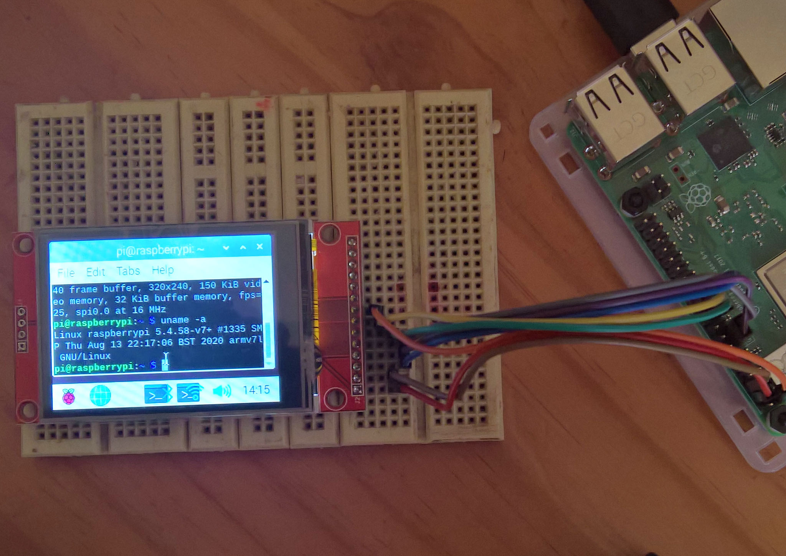

# ILI9341 Displays

[**ElectroDragon (EDS) LCD Displays SPI SD-Card Touch Size 1.8 to 4.0 inches**](https://www.electrodragon.com/product/eds-tft-lcd-lcm-spi-interface-variable1-82-2/)

**2.4 inch Model 320x240:** 
Top and bottom and schematic:

  
 
  
 
The SDCard as configured on this model will not function when interfaced with a 3v3 MCU. To correct it, replace the 3 x 1k series resistors R1, R2, R3 with 0 ohm resistors or a solder bridge. Also connect SD-CS to a 10k resistor pullup to 3v3.

The display as supplied is also not in a Raspberry Pi GPIO compatible pin format. Details will be given below to connect it to a Raspberry Pi standard 40 pin GPIO connector.

Connect the display to Raspberry Pi (3B+ used):

|     LCD     | Pin  | RaspPi |  
|-------------|------|--------| 
|1 Vcc +5v    |	2 	  |  +5v   |  
|2 Gnd 	      |	6    |  Gnd   |  
|3 LCD-CS S   | 24	  | GPIO 8 | 
|4 RST Reset  |	13 	 | GPIO 27| 
|5 DC         | 15 	 | GPIO 22|  
|6 MOSI       |	19 	 | GPIO 10|  
|7 SCLK       | 23	  | GPIO 11| 
|8 LED        | 1	   | +3v3   |  
|9 MISO       |  	   |   NC   | 

*Note: Sometimes other Raspberry Pi pins are used for Reset and Data Control such as pin 22 (gpio 25) for reset and pin 18 (gpio 24) for dc. The pins numbers in the table above are those used by goodtft in his LCD24-show driver, and also by swkim01 for hist waveshare32b driver. Notro has a dts driver for the ili9341 but that uses different dc and reset pins and has not been tried (i.e. compiled to a dtbo driver).

### Kernel 5.45
I used the nightly kernel 2020-08-12-raspios-buster-nightly-armhf.img and the dts driver from [**swkim01**](https://github.com/swkim01/waveshare-dtoverlays), who has compiled a waveshare ILI9340 driver for kernel 5.4 that can also be used for this type of ILI9341 LCD display:

* git clone https://github.com/swkim01/waveshare-dtoverlays.git
* sudo cp waveshare-dtoverlays/waveshare32b.dtb /boot/overlays/waveshare32b-overlay.dtb
* sudo cp waveshare-dtoverlays/waveshare32b.dtb /boot/overlays/waveshare32b.dtbo

Now use the Zaryob github [**Zaryob LCD-show**](https://github.com/Zaryob/LCD-show), edit his local copy of LCD35C-show and comment out the sudo reboot at the end. Then proceed as shown below, but before the sudo reboot, edit /boot/config.txt and correct the line dtoverlay=waveshare35c:rotate=90 to dtoverlay=waveshare32b:rotate=270 (i.e add the driver overlay for ili9341 from swkim01).

* git clone https://github.com/Zaryob/LCD-show.git
* cd LCD-show/
* chmod +x LCD35C-show
* sudo ./LCD35C-show
* sudo reboot

The result is shown below:

  
 
 

  
  
 

 

